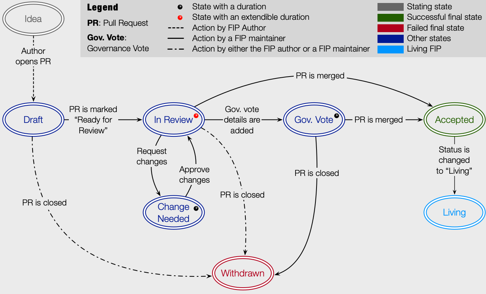

## Next FIP number: 002

# Fetch Improvement Proposals (FIP)

## What is a FIP?

**FIP** stands for **Fetch Improvement Proposal**. A FIP is a design document providing information to the Fetch community, or describing a new feature for the Fetch ecosystem, its processes, protocols, or environment. A FIP should provide technical specification of the feature being proposed and the rationale for it. The FIP author is responsible for building consensus within the community and documenting dissenting opinions.

## Purpose of FIPs

FIPs are the primary mechanism for proposing new features or changes to existing ones including network parameters, ecosystem tool features, and processes related to the Fetch ecosystem. FIPs will further serve as a tool to collect community input on technical and process-based issues for both design and implementation decisions. FIPs will be maintained in textual format, in a versioned repository that provides an audit trail of discussions and decisions from its inception to either implementation or rejection of the proposal. This information will also help the community know the current state of the proposal.

## FIP Types and Scope

### Technical track

These include proposals made in relation to the technical components. Most technical FIPs will not result in a governance proposal. 

The scope of the technical FIPs will include the following components:

- Core and client software
  - FetchD: [https://github.com/fetchai/fetchd](https://github.com/fetchai/fetchd)
  - Cosmpy: [https://github.com/fetchai/cosmpy](https://github.com/fetchai/cosmpy)
  - AEA Framework, including the ACN and packages authored by Fetchai: [https://github.com/fetchai/agents-aea](https://github.com/fetchai/agents-aea) and [https://pypi.org/project/aea](https://pypi.org/project/aea)
- Applications and user interfaces
  - Fetch Wallet: [https://github.com/fetchai/fetch-wallet](https://github.com/fetchai/fetch-wallet)
  - AEA Manager Website: [https://github.com/fetchai/agents-manager-app-site](https://github.com/fetchai/agents-manager-app-site)
- Documentation updates
  - Updates to technical documentation: [https://github.com/fetchai/docs](https://github.com/fetchai/docs)

### “Standards” track

“Standards” FIPs are those that define new standards and (sub-)protocols. Once a “Standards” FIP is approved, it will result in an FRC - Fetch Request for Comment - standard. 

### Ecosystem track

Ecosystem FIPs include proposals which impact the functioning of the Fetch mainnet and disbursement of community funds towards ecosystem development.

Examples of proposals which impact the functioning of the Fetch mainnet include: 
- Network configuration updates
- Changes to the transaction fees
- Changes to the validator delegation commission
- Addition of new network parameters

**Note -** The Fetch foundation currently acts as the core developer of the Fetch protocol and as the reviewer of FIPs will reserve the right to require a FIP to also be approved via a governance proposal.

## FIP WorkFlow

### FIP states

- **Idea:** An idea that is pre-draft and is worked on by its author. This is not formally tracked within the FIP repository. At this stage the author scans the discussions and existing FIPs to confirm that the idea is truly unique and gauges community support by initiating discussions and/or informal polls about it.
  - **To Draft:** At some point, the author creates a draft pull request with the proposal, assigns the correct FIP number to it, and tags a FIP maintainer for review.
- **Draft:** The first formally tracked stage of a FIP in development. A FIP maintainer performs a quick review of the FIP, makes minor changes (e.g. corrects an invalid FIP number) and determines the durations for the upcoming stages (i.e. `<review_duration>`, `<last_call_duration>`, `<author_response_wait_time>`).
  - **To In-Review:** If the FIP conforms with minimal standards, the pull request is marked as “ready for review”. 
  - **To Withdrawn:** If the FIP does not conform with the minimal standards, the pull request is closed by a FIP maintainer and the FIP is withdrawn. The author may also close the pull request at any point for any reason.
- **In Review:** This is where the FIP receives reviews by the public. The FIP is already assigned a set duration `<review_duration>` by a FIP maintainer in the previous stage based on its complexity, although this duration may be extended multiple times by FIP maintainers if they believe the FIP needs more discussion.  
Some time (i.e. `<last_call_duration>`) before the end of the reviewing period, a last call is announced for this FIP to remind the public to get involved, engage and leave their comments. To do so, the FIP’s pull request is assigned a `last call` label. This will be combined with some publicity efforts to ensure the community is sufficiently informed.
  - **To Change Needed:** During the review process, there might be changes requested to the FIP by reviewers. If based on the comments, a FIP maintainer believes changes are warranted and there is enough consensus for them amongst the reviewers, they will officially request these changes and the FIP moves into the “Change Needed” state. The FIP maintainer requests changes via GH’s “request changes” feature on the pull request.
  - **To Gov. Vote:** At the end of the reviewing period, if there are no more comments raised on the FIP, it may be moved into the Governance Vote stage if the FIP is of a kind that requires one.
  - **To Withdrawn:** At any point during the review stage, if argument(s) are brought up about the proposal being unsuitable and there is consensus on that, a FIP maintainer will close the pull request and the FIP is withdrawn. At any point, the author could also close the pull request down, thus withdrawing the FIP.  
At the end of the reviewing process, if the discussion concludes unsuitability and the FIP does not need a governance vote, it will be withdrawn (pull request is closed) by a FIP maintainer.
  - **To Accepted:** At the end of the reviewing process, if there are no more objections raised and the FIP is of a kind that does not need a governance vote, the FIP is accepted (pull request is merged) by a FIP maintainer.
- **Change needed:** When changes are requested for a FIP on the pull request, the author could apply those changes and request for a re-review. If the FIP maintainer believes that the changes are not sufficiently or properly implemented, it informs the author and the FIP stays in the “Change Needed” state.  
If after `<author_response_wait_time>` time, the author does not respond to this request, a FIP maintainer may step in and apply the changes.
  - **To In Review:** After reviewing the changes made, if the FIP maintainer is convinced the changes are in fact applied, the FIP is moved back to “In Review” by dismissing the “request changes” on the pull request.
- **Gov. Vote:** Some FIPs require a governance vote before being accepted. Once a FIP moves into this state, a FIP maintainer will create a governance vote and add its details (e.g. where to vote) in the FIP pull request. Voting has an associated time period during which people can vote on the outcome of the FIP. 
  - **To Accepted / Withdraw:** The FIP will be Accepted (pull request merged) or Withdrawn (pull request closed) depending on the outcome of the vote.
- **Withdrawn;** The FIP is withdrawn. This state has finality and the FIP can no longer be resurrected using this FIP number. It is clear that every FIP that is withdrawn is automatically in the Idea state because the discussions related to it still exist and can be referred back to and continued. If the idea is pursued at a later date, it is considered a new proposal and must use a new FIP number.
- **Accepted:** A FIP that is accepted either after a governance vote or without one.
  - **To Living:** For a FIP to be living, its status (a part of the FIP’s specification) will be changed to “Living”.
- **Living:** This is a special state for FIPs which can be continually updated after acceptance. Most notable such FIP is FIP-000.

### Instructions for Authors

#### Idea

1. Scan [existing FIPs](), [documentation](docs.fetch.ai) and [discussions]() to ensure your proposal is not an existing feature or one that is being considered via an existing or in-progress FIP or discussed by others.
2. Initiate discussions and/or informal polls about the topic to assess its popularity, gather feedback, receive alternatives and generally gauge community support. You can use the [“Discussions” part of the FIPs repo]() or [other technical repos](#technical-track) for this purpose.
3. If the idea proves sound and popular after engaging with the community, you can open a pull request with your FIP in the FIP repository. To do so:
   1. Fork the repository by hitting Fork in the top right.
   2. Add your FIP to your fork of the repository, ensuring that it conforms with the [formatting guidelines](#formatting-and-template).
   3. Submit a pull request to the [FIPs repository]().
4. If you do not know how to use the git command line interface, you can follow this instruction to opening a pull request on GitHub’s website:
   1. Ensure you are logged into your GitHub account
   2. Note the correct [next FIP number](#next-fip-number-002).
   3. Go to the [FIPs directory]() and hit **Add file** then **Create new file**.
   4. In the **Name your file...** field, enter `fip-xxx.md` replacing `xxx` with the fip number you noted above.
   5. Under **<> Edit new file**, you can write the content of the FIP. Make sure it conforms with the [formatting guidelines](#formatting-and-template). To make it easier, you can copy and paste [this template](./fip-template.md) and make your edits. Ensure FIP’s `status` is `draft` and that you leave `Withdrawal-reason` empty.
   6. Once finished, under **Commit new file**, write `creation` in the first field, leave the next field empty, and ensure you select **Create a new branch for this commit...**. In the field that appears, enter `fip-xxx` replacing `xxx` with the FIP’s number.
   7. At this point, copy the FIP’s preamble (the text between `---`) into the clipboard and hit **Propose new file**.
   8. In the next screen, change title from `creation` to `fip-xxx` replacing `xxx` with the FIP’s number.
   9. Where it says **Leave a comment**, paste the preamble.
   10. On the green button, hit the arrow and select Create** draft pull request**, then hit the green button.
   11. Under **Reviewers** on the right hand side, hit the cog icon and select a few names to review this FIP’s pull request.

#### Draft

At this point, your pull request is screened by a FIP maintainer and they might make minor changes (e.g. correct an invalid FIP number). If the FIP conforms with minimal standards, the maintainer will mark this as ready for review. Otherwise, they might get in contact with you to make some changes or they might close the pull request and withdraw the FIP.

### In Review

The FIP receives reviews by the public. The FIP may be withdrawn at any point if justification(s) are brought up about the proposal being unsuitable.

At the end of the reviewing period, the FIP is Accepted or Withdrawn either depending on the governance vote results or, if the FIP is of a kind that does not require a governance vote, based on the feedback received during the review stage.

### Change needed

During the review process, a FIP maintainer may officially request changes to be made to the FIP based on the feedback by the community. The authors collectively have some time to respond and apply the changes. This time `<author_response_wait_time>` is set by a FIP maintainer in the draft stage and is clearly communicated in the pull request’s preamble. If the authors do not respond to the requested changes within this time period, a FIP maintainer may step in and apply the changes themselves. 

To make changes using GitHub’s website:

1. From the pull requests page hit **File changed**. 
2. Hit the three dots on the right, then **Edit file**. 
3. Under **<> Edit new file**, you can edit the content of the FIP and apply the requested changes. 
4. Once finished, under **Commit new file**, write update in the first field, leave the next field empty, and ensure the **Commit directly to the fip-xxx branch** is selected.
5. Hit **Commit changes**.
6. Go back to **Conversation** and hit the **Re-review** icon next to the reviewers for this pull request.

A FIP maintainer will rereview the FIP and, if satisfied with the changes made, will remove their request, otherwise will inform you of the change(s) still needing to be made. 

#### Withdrawn

If the FIP is withdrawn, it cannot be resurrected using its FIP number. The FIP is automatically in the Idea stage because the discussions related to it still exist and can be referred back to and continued. If you want to pursue the idea at a later date, it is considered a new proposal and you must use a new FIP number (although for reference, it is recommended that a link to the related withdrawn FIP is included in the new FIP).

## Formatting and Template

FIPs should be written in [markdown format](https://github.com/adam-p/markdown-here/wiki/Markdown-Cheatsheet).

### FIP numbers

When referring to a FIP by number, it should be written in the hyphenated form `FIP-xxx` where `xxx` is the FIP’s assigned number.

### Images

If your FIP requires images, the image files should be included in a subdirectory of the assets directory for that FIP as follows: `assets/fip-xxx` (where `xxx` is replaced with the FIP number). When linking to an image in the FIP, use relative links such as  `../assets/fip-1/image.png`.

### Linking to other FIPs

References to other FIPs should follow the format `FIP-xxx` where `xxx` is the FIP number that the FIP is referencing. Each FIP that is referenced in a FIP **MUST** be accompanied by a relative markdown link the first time it is referenced, and **MAY** be accompanied by a link to subsequent references. The link **MUST** always be done via relative paths so that the links are correct within the GitHub repository, along with forks of the repository, the main FIPs website and mirrors are correct.

### FIP Header Preamble

Each FIP must begin with an [RFC 822](https://www.ietf.org/rfc/rfc822.txt) style header preamble, preceded and followed by three hyphens (`---`). This header is also termed [“front matter” by Jekyll](https://jekyllrb.com/docs/front-matter/). The headers must appear in the following order.

- `fip`: FIP number (this is determined by the FIP editor)
- `title`: The FIP title is a few words, not a complete sentence
- `author`: The list of the author’s or authors’ name(s) and/or username(s), or name(s) and email(s).
- `description`: Description is one full (short) sentence
- `discussions-to`: The url pointing to relevant discussion threads and polls (preferrably [GitHub discussions on the FIP repository]() or [other repositories](#technical-track)
- `status`: One of `Draft`, `In-review`, `Voting`, `Accepted`, `Withdrawn`, `Living` (the `change needed` state is a part of `In-review`)
- `type`: [One of `Technical` , `Standards` , or `Ecosystem`](#fip-types-and-scope)
- `created`: Date the FIP was created
- `requires`: FIP number(s) (Optional field to indicate dependent FIPs)
- `withdrawal-reason`: A sentence explaining why the FIP was withdrawn. (Optional field, only needed when status is Withdrawn)

### Template

To make it easier to create FIPs, you can copy and paste [this FIP template](./fip-template.md) and make your edits. 

## Disclaimer

The material in this document is inspired by and derived from [Ethereum’s EIP-1](https://eips.ethereum.org/EIPS/eip-1) written by Martin Becze, Hudson Jameson, et al., "EIP-1: EIP Purpose and Guidelines," *Ethereum Improvement Proposals*, no. 1, October 2015. [Online serial]. Available: [https://eips.ethereum.org/EIPS/eip-1](https://eips.ethereum.org/EIPS/eip-1).